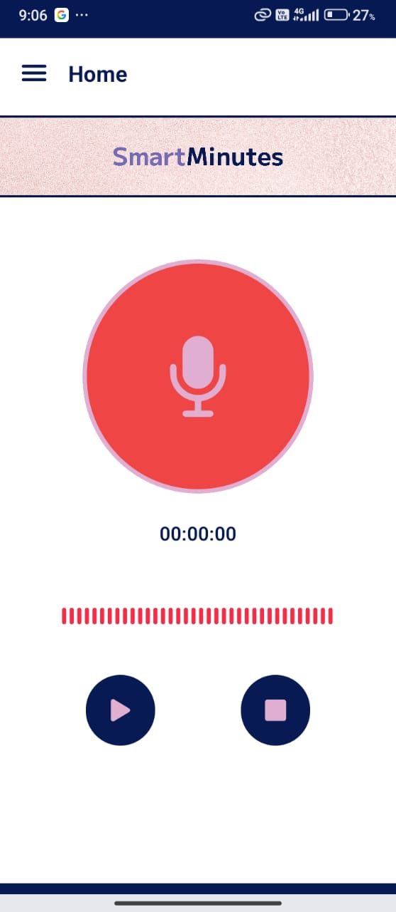
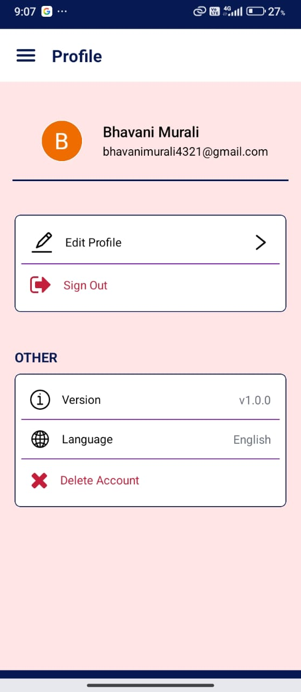
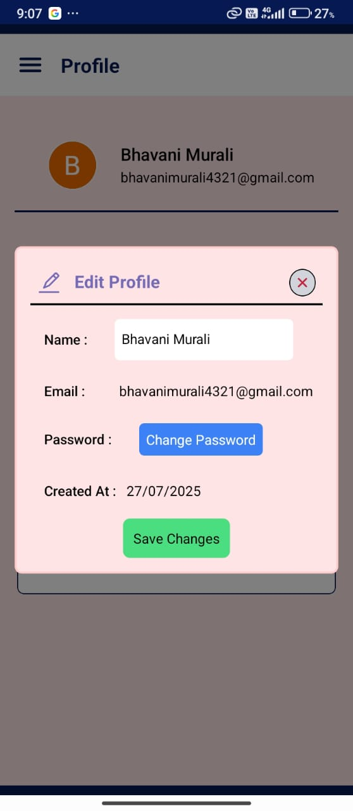
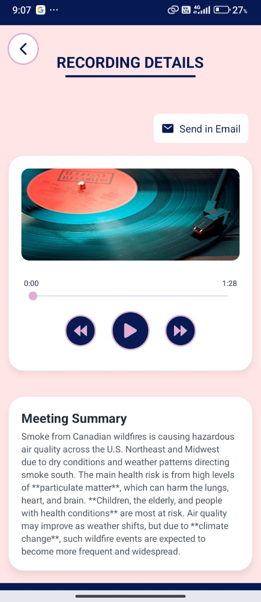

# 🚀 SmartMinutes – AI Meeting Minutes Generator App

SmartMinutes is a productivity-focused mobile app designed to simplify the way teams handle meetings. It transforms recorded conversations into transcripts, summaries, and shareable minutes, so professionals never miss key discussion points again.

## ✨ Features
- 🎙️ AI-Powered Transcription - Convert meeting audio into accurate text using Hugging Face speech models.
- 📝 AI Summarization - Generate concise, context-aware meeting summaries for quick review.
- 📩 Automated Email Sharing - With Zapier integration, SmartMinutes instantly sends minutes to all participants.
- ☁️ Cloud Storage with Firebase - Securely store and access your meeting history across devices.
- 📱 Cross-Platform App - Built with Expo (React Native) for seamless Android and iOS support.

## 📸 Screenshots
### 🔹 Splash & Auth

   
   
   

### 🔹 Main App Flow

   
   
   
   

### 🔹 Recording & Saved

   
   

## 🛠️ Tech Stack
- Frontend / App: Expo (React Native)
- Backend / Database: Firebase
- AI Models (Transcription + Summarization): Hugging Face Transformers
- Automation & Emails: Zapier

## 🔗 Integrations
- Firebase – User authentication, database, and storage
- Hugging Face – AI models for transcription & summarization
- Zapier – Automated email workflow
